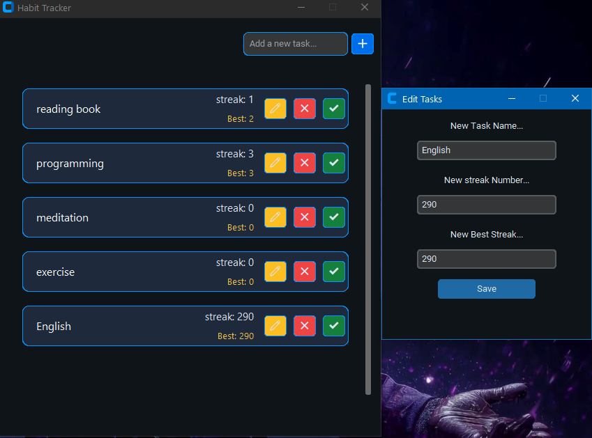

# 🎯 Habit Tracker

A modern desktop application to manage daily habits and build long-term streaks. Built with **Python** and **customtkinter**.

---

## ✨ Features

- **Add Tasks** - Create habits with validation (no duplicates or empty names)
- **Mark Done** - Increment streak and track personal records
- **Edit Tasks** - Modify task names, streaks, and best records
- **Delete Tasks** - Remove habits from your list
- **Dark Theme UI** - Modern, eye-friendly interface with color-coded buttons
- **Real-time Feedback** - Instant notifications for all actions
- **JSON Storage** - Persistent data that auto-saves

---

## 📋 Planned (Long-term)
- Visual calendar view for tasks
- Enhanced color-coded status display
- Backup and restore functionality
- Data export (CSV, PDF)

---

## 📸 Screenshots



---

## What I Learned

Building this project from a single CLI file to a full GUI application taught me:


- Python project structure and modular design
- Object-Oriented Programming (classes, methods, separation of concerns)
- File operations and JSON handling
- Error handling and input validation
- GUI development with customtkinter (layout, events, popups)
- Git workflow (branches, commits, merging, tagging)

## 🛠️ Installation

```bash
pip install customtkinter
python main.py
```

---

## 🏗️ Project Structure

### What Each Module Does

- **`main.py`** - Application entry point, initializes the app
- **`database.py`** - Handles all JSON file operations (loading and saving tasks)
- **`manager.py`** - Contains all task operations (add, edit, remove, mark done, etc.)
- **`gui.py`** - Handles UI components and user interactions with customtkinter
- **`theme.py`** - Stores all GUI theme colors and styling

---

## 🚀 Quick Start

```bash
python main.py
```

### How to Use
1. Type habit name → Click blue "➕" button
2. Click green "✔️" to mark done (streak increments)
3. Click yellow "✏️" to edit task
4. Click red "❌" to delete task

---

## 🎨 UI Colors

- 🟢 **Green** - Mark task done
- 🟡 **Yellow** - Edit task
- 🔴 **Red** - Delete task
- 🔵 **Blue** - Add new task

